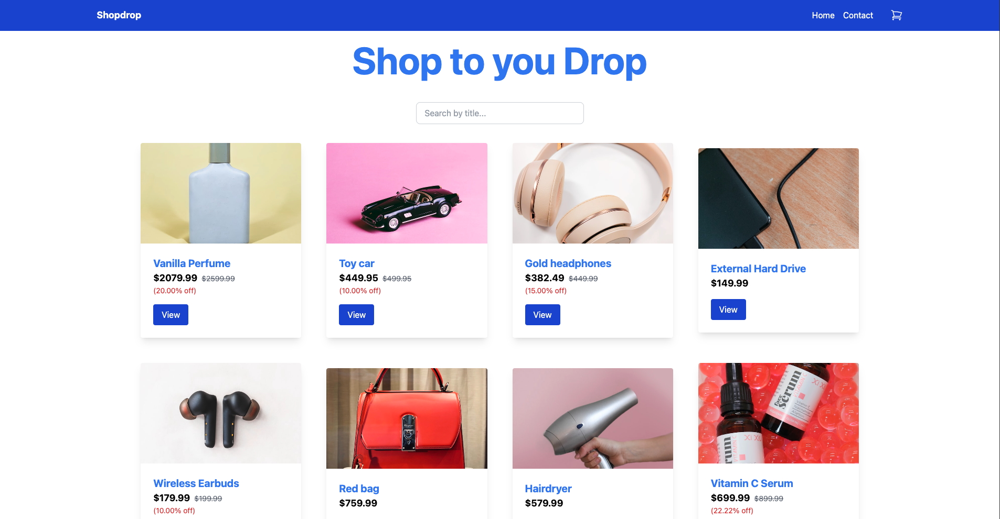

# Shopdrop - Semester project 2



This is my delivery on Front-end Frameworks where you can add to cart and make a purchase.

## Assignement

Build out the following pages for an eCom store:

- Homepage
- Individual product page
- Cart page
- Checkout success page
- Contact page
  The Homepage should have a list of all the products. There should be a look-ahead search bar that filters products when typing in a product name. Clicking on a product should take a user to an individual product page.

### Points

- Use a <Layout> component with a header (nav bar + Cart icon showing item count) and footer.
- The product page shows product details (title, description, image) with an "Add to Cart" button, reviews (if any), and displays the discountedPrice with a calculated discount if applicable.
- Clicking the Cart icon loads the Cart page with a list of products, total price, and a "Checkout" button.
- The Checkout success page confirms the order, provides a link to return to the store, and clears the cart.
- The contact page includes a form (Full Name, Subject, Email, Body) with validation for each field (min 3 characters, valid email).
- Use React Router for navigation; design should be responsive with CSS Modules or styled-components (framework optional).
- Ensure clean, well-formatted code.

## Built With

- React
- Vite
- Tailwind

## Getting Started

### Installing

First, clone the repository to your local machine:

```
npm install
```

```
npm run build
```

## Contributing

If you find any issues or make any improvments you can make a pull request or contact me using the contact information provided on my profile.

## Contact

[My Github](https://github.com/Zaracki)
